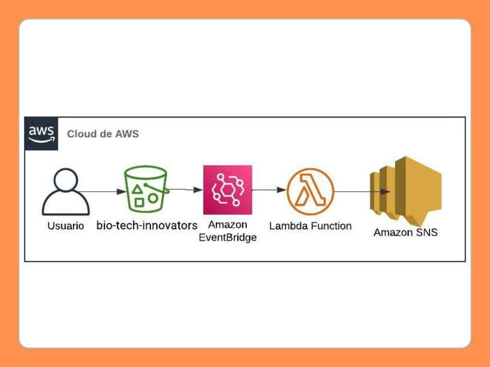
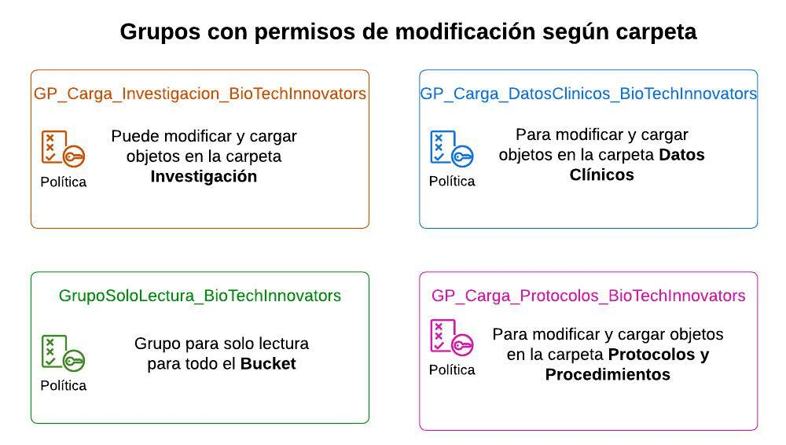
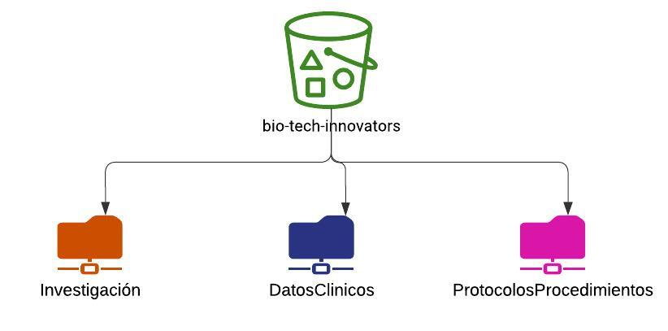

Optimización de la Gestión y Procesamiento de Datos en BioTechInnovators Utilizando AWS y Habilidades en Ingeniería de Datos

## Desafíos Clave:

1. Método de Carpetas Compartidas: Compartición de datos ineficiente y propensa a errores.
2. Compartir Archivos: Falta de acceso seguro y controlado a los archivos.
3. Respaldo de Archivos: Necesidad de soluciones confiables de respaldo de datos.

## Propuesta de Solución:

1. Amazon S3 para la Gestión de Archivos:
    - Gestión eficiente de archivos.
    - Compartición segura de archivos.
    - Respaldo y protección robustos de datos.

2. Optimización de Costos con S3 Intelligent-Tiering:
    - Clasificación automática de datos.
    - Gestión de almacenamiento rentable.

## Equipos y Políticas de Permisos:

1. Equipo de Investigación: Acceso a datos de investigación.
2. Equipo Clínico: Acceso a resultados clínicos.
3. Equipo de Calidad y Compliance: Acceso a protocolos y procedimientos.

## Estructura y Volumen de Información:

1. Carpetas y Propósitos:
    - Datos de Investigación
    - Resultados Clínicos
    - Protocolos y Procedimientos
2. Volumen de Información: Estimación y gestión.

## Solución Técnica:

1. Creación de Grupos IAM:
    - Definición de roles y permisos.
2. Plantillas de Usuarios IAM:
    - Configuración estandarizada de usuarios.
3. Políticas IAM:
    - Permisos específicos de acceso para cada carpeta.
4. Plantillas de Lambda y SNS:
    - Notificaciones y procesamiento automatizados.
5. Plantillas de S3 y EventBridge:
    - Activadores automáticos para eventos de datos.